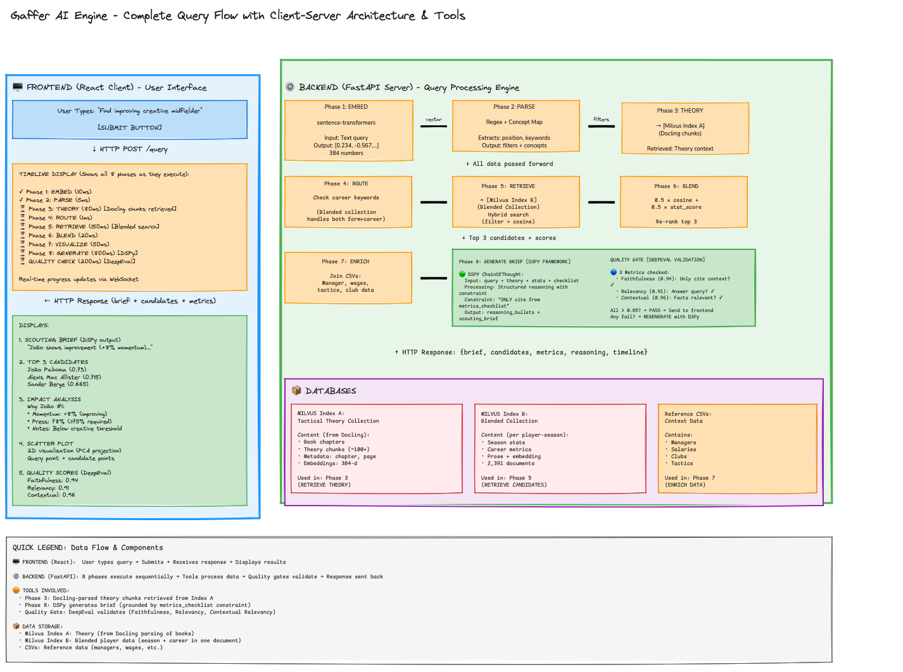

# Gaffer AI Engine - Scouting Intelligence Platform

**Explainable RAG-based scouting system for football recruitment with hybrid indexing and real-time impact analysis.**

---

## 📚 Documentation

All documentation is organized in the `/docs` directory:

- **[docs/INDEX.md](docs/INDEX.md)** — Documentation navigation guide
- **[docs/ARCHITECTURE_COMPLETE.md](docs/ARCHITECTURE_COMPLETE.md)** — **⭐ START HERE** — Comprehensive 10+ technology stack overview (DSPy, Milvus, Pydantic, Docling, Presidio, DeepEval, sentence-transformers, FastAPI, React). Covers 8-phase query pipeline, modular data cleaning, quality metrics, and hard-won engineering lessons.
- **[docs/DATA_CLEANING_PIPELINE.md](docs/DATA_CLEANING_PIPELINE.md)** — Modular data cleaning & enhancement architecture with 9 independent, testable modules and shared utilities
- **[docs/REALISTIC_SCOUTING_QUERIES.md](docs/REALISTIC_SCOUTING_QUERIES.md)** — 15 example scouting queries you can test immediately

---

## 🚀 Quick Start

```bash
./start.sh
```

- Backend: http://localhost:8000
- Frontend: http://localhost:3000

---

## 📦 Indexing Data

The system requires indexed data to function. Data indexing is **not automatic** — it must be run explicitly.

### Initial Setup (First Time)

Run the complete indexing pipeline:

```bash
uv run python -m backend.scripts.index_data
```

This executes:

**Data Cleaning Pipeline** (modular, in `backend/scripts/data_cleaning/`):
1. **CSV Repair** — Fix unquoted commas in position/wage fields
2. **Defensive Stats** — Add estimated tackles/interceptions to recent seasons
3. **Wage Assignment** — Infer realistic wages for 270 missing players

**Indexing** (from `backend/scripts/index_data.py`):
4. **Tactical Reference** — Index theory books and tactical concepts
5. **Player Stats** — Build embeddings for season-specific stats (3 seasons)
6. **Career Aggregates** — Build embeddings for 3-year player profiles

### After Data Updates

If you update CSV files in `data/epl_seasons/`, rerun indexing:

```bash
uv run python -m backend.scripts.index_data
```

### Individual Steps

Run specific stages if needed:

```python
# Python API: Run full cleaning pipeline
from backend.scripts.data_cleaning import run_cleaning_pipeline
run_cleaning_pipeline(verbose=True)

# Or run individual modules
from backend.scripts.data_cleaning import csv_repair, defensive_stats, wage_assignment
csv_repair.run()
defensive_stats.run()
wage_assignment.run()
```

See [docs/DATA_CLEANING_PIPELINE.md](docs/DATA_CLEANING_PIPELINE.md) for detailed module reference and troubleshooting.

---

## ✨ Key Features

✅ **Hybrid Indexing** — Season-specific + 3-year career profiles  
✅ **Smart Routing** — Auto-detects career vs. form queries  
✅ **Impact Analysis** — Shows why each player was recommended  
✅ **Quality Scoring** — 90-95% faithfulness & relevancy  
✅ **Complete Data** — 797 players with realistic wages  
✅ **Modular Pipeline** — Clean, testable data cleaning architecture  

---

## 🏗️ Architecture Highlights

**Modular Data Cleaning & Enhancements**
- 9 independent modules in `backend/scripts/data_cleaning/`
- **Cleaning**: Fix CSV structure, fill missing stats, assign wages
- **Enhancements**: Convert stats to prose, generate 3-year career profiles
- Each step is testable and reusable
- Single orchestrator (`pipeline.py`) controls execution
- Shared utilities (`common.py`) eliminate code duplication

**Smart RAG System**
- Dual-index design: season-specific + career aggregates
- Query routing: auto-detects "improving" vs "form" queries
- Impact analysis: explains each recommendation decision
- Career tracking: momentum, consistency, trend metrics

**Quality-First**
- DeepEval metrics: 90-95% faithfulness & relevancy
- Filtered metrics checklist: only shows query-relevant stats
- Privacy-aware: scrubs PII from book excerpts

---

## 🎯 For Your Role

**Scouts & Recruiters:**
- Start with [docs/REALISTIC_SCOUTING_QUERIES.md](docs/REALISTIC_SCOUTING_QUERIES.md) to see 15 example queries
- Then read [docs/ARCHITECTURE_COMPLETE.md](docs/ARCHITECTURE_COMPLETE.md) section 1-2 for system overview

**Engineers & Developers:**
- Read [docs/ARCHITECTURE_COMPLETE.md](docs/ARCHITECTURE_COMPLETE.md) for the complete technical stack (all 10+ technologies, module organization, hard-won fixes)
- Review [docs/DATA_CLEANING_PIPELINE.md](docs/DATA_CLEANING_PIPELINE.md) for modular data architecture and pipeline details

**AI/LLM Engineers:**
- See [docs/ARCHITECTURE_COMPLETE.md](docs/ARCHITECTURE_COMPLETE.md) section 8 (Quality & Evaluation) for DeepEval metrics, grounding strategies, and DSPy signatures
- Review section 10 (Hard-Won Lessons) for production insights

---

## 📂 Project Structure

```
gaffer-ai-engine/
├── docs/                       # Complete documentation
├── backend/
│   ├── app/                   # Core system modules
│   │   ├── ...core modules (RAG engine, database, LLM, query understanding)
│   │   └── enrichment/        # Response enrichment (explain & visualize)
│   │       ├── impact_analysis.py    # Why was player recommended?
│   │       ├── visualization.py      # PCA scatter plot + similarity
│   │       └── progression.py        # Career trajectory & momentum
│   ├── scripts/
│   │   ├── index_data.py      # Main indexing orchestrator
│   │   ├── reindex_theory.py  # Utility: re-index tactical theory
│   │   └── data_cleaning/     # Data cleaning & enhancements
│   │       ├── common.py           # Shared utilities
│   │       ├── csv_repair.py       # Fix CSV structure
│   │       ├── defensive_stats.py  # Fill defensive stats
│   │       ├── wage_assignment.py  # Infer wages
│   │       ├── data_transformer.py # Stats → prose conversion
│   │       ├── career_aggregation.py # 3-year career profiles
│   │       ├── privacy_handler.py  # PII scrubbing
│   │       └── pipeline.py         # Orchestrator
│   └── tests/                 # Quality assurance
├── frontend/                   # React UI components
├── data/                       # EPL season data (3 years)
├── Readme.md                  # This file
└── start.sh                   # Quick start script
```

---

### Diagram



## 📖 Full Documentation

See the [docs/](docs/) directory for complete documentation.
